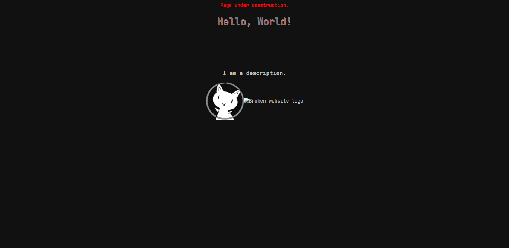
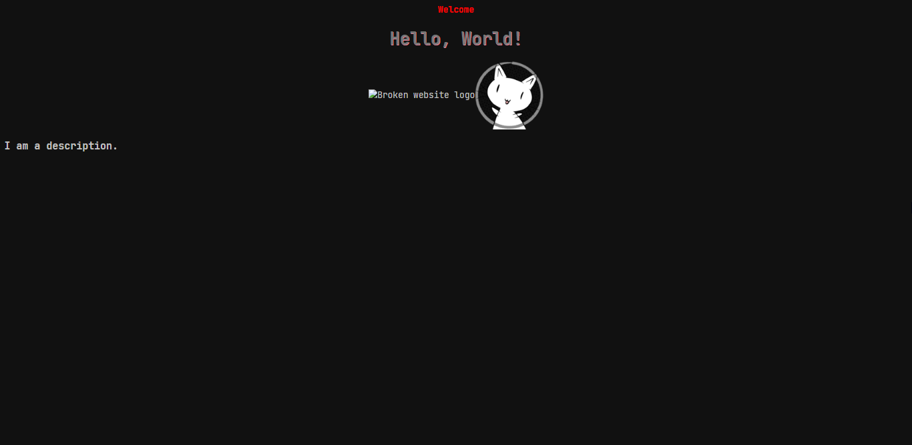

# Lesson 2 - Understanding what we are doing

## Table of contents
* ❯❯ Lesson 2
    * ❯❯ [Table of contents]()
    * ❯❯ [Goals]()
    * ❯❯ [⚠️ Notices (Please Read)]()
    * ❯❯ [Section 1 - Introduction to HTML DIVs and JavaScript]()
        * ❯❯ [Breakdown]()
        * ❯❯ [Void elements]()
        * ❯❯ [HTML DIVs]()
        * ❯❯ [IDs and Classes]()
        * ❯❯ [Combining everything in Section 1]()
    * ❯❯ [Section 2 - Make a HTML application with the usage of only HTML and JS and removing CSS]()
        * ❯❯ [About]()
    * ❯❯ [Section 3 - Make a HTML application with a JS integration and learning the abilites of CSS styling]()
    * ❯❯ [Guides]()
        * ❯❯ [How to fork a repo]()
        * ❯❯ [How to clone a repo]()
        * ❯❯ [How to install Visual Studio Code]()
        * ❯❯ [How to install GitHub Desktop]()
        * ❯❯ [How to install GIT]()


## Goals
#### ❯ [Introduction to HTML DIVs and JavaScript.]()
#### ❯ [Make a HTML application with the usage of only HTML and JS and removing CSS.]()
#### ❯ [Make a HTML application with a JS integration and learning the abilites of CSS styling.]()

## ⚠️ Notices
This lesson involves lots of basic HTML, CSS, and JS concepts. If any of this lesson feels difficult or incomprehendable, DM me on Discord ([Kurasad#2521](https://discord.com/users/476812566530883604)) and I will be happy to help.

## Section 1
### ❯❯ Introduction to HTML DIVs and JavaScript
<hr />

HyperText Markup Language (HTML) is a very basic structural layout of a webpage containing most of the data and unique identifiers. HTML data is categorized with the use of tags, an `<i>` tag will italicize the text inside and a `<div>` will act as a parent block to make sure everything inside stays together, generally. There are many tags that are used in HTML and each one serves a different purpose. Each tag has it's own styling and formatting (CSS). All descriptions of the layout of HTML code is relative since CSS can be used to modify and change the elements in any way possible. HTML & CSS do not have logical errors, there are syntax errors but everything written will exist on the page. 

### Breakdown
First, lets breakdown what a HTML page would generally look like.
```html
<html>

    <head> </head>

    <body> </body>

</html>
```

The `<html>` tag exists to define where the content of the page is. The `<head>` tag exists to hold all preloadable data, such as the CSS styles for the page or the `<meta>` tags. Meta tags define the webpage and are used in Google searches and on the page itself. Meta tags are used to hold the website's name, icon, description, and any other information about the webpage necessary for it to be identified on external services. The `<body>` tag is for holding the website content and the JavaScript imports/scripts, this is what the user will see when the visit the webpage. Almost all HTML tags need a closing tag, the `<body>` tag has `</body>` and so on, but some elements are not built to be closed. Such elements are called void elements and all the content necessary for these tags exist with one opening tag. The tags defined as void are the following: ``, `<hr />`, and `<br />`.

### Void elements
The `` tag is for importing external and local images to the webpage, the image tag has properties such as `src` and `alt` which define properties of the image and how the image can be interacted with. The image `src` property defines what image to show to represent the tag and is a required image property, ex: ``. The image `alt` property defines what the image should represent in the case that the `src` property has an invalid image URL, the `alt` property is a required image property, ex: ``. The image `title` properly exists to hold a string that the user can read when hovering over the image (tooltip), this is an optional image property but is useful for icons, ex: ``
The image tag also has the `id`, `class`, and `style` properties like all other tags. The other two tags (`<br />` and `<hr />`) are both used for formatting and only have `id`, `class`, and`style` properties. `<br />` is used as a newline element, in Javascript and other programming languages a newline break is defined by a `\n` but in HTML a `<br />` tag is used. The `<hr />` tag is used as a newline element with extra styling defaults, it also acts as a line break but adds a literal line at the break. All void elements are opened and closed within the same tag, the `/>` is a closing statement within the tag. This is optional to close the tag but will show up as an error.

### HTML DIVs
It is a good habit to group HTML elements with other elements that serve a similar purpose or function. Such as a navbar, all tab options are part of the nav bar, therefore they are "children" of the "parent" element navbar. This structure is how HTML works. A parent element contains children and the children can either have more children or contain data. Below is a structure that contains parents and children.
```html
<body>
    <a> Page under construction. </a>

    <div>
        <h1> Hello, World! </h1>
    </div>
    
    <div>
        <h3> I am a description. </h3>
        <div>
            
        </div>
    </div>

</body>
```

This snippet shows the structure of a HTML page content, The `<a>` tag is usually for text that is hyperlinked, the `<a>` tag is the only tag that can hyperlink text (without the use of JS). The first `<div>` tag contains a `<h1>` tag, this is a styling tag that is used for headings, the range is from `<h1>` to `<h6>`. The `<h1>` tag in this scenerio is a child to the parent element `<div>`. The second div contains two children, a `<h3>` tag and another `<div>`, the child `<div>` is also a parent since it contains an `` tag inside.
The image tag is a member of both div tags for that section. The DIVs help organize and format the page's content so that each section of data correlates to the data around it and interacts properly with each elements within the same scope and with elements not in the same scope.

### IDs and Classes
In the previous section a troublesome visualization would be understanding what each div represents and what content it holds. This is where the existance of IDs and Classes are useful. A HTML `id` is a property of an element and should exist for ONLY 1 element of the same scope, it is fine for having the same ID for a different element in a different scope but it might still cause issues for fetching the element in JavaScript. A HTML `class` is also a property of an element but can exist at any scope and can contain multiple values. For styling overlap between `id` and `class` the ID property would be superior unless the `class` style contains a `!important` parameter. Below is the same example from the section before but with proper identification.
```html
<body>
    <a id="notice"> Page under construction. </a>

    <div id="title">
        <h1 id="message" class="title"> Hello, World! </h1>
    </div>
    
    <div id="content" class="about images">
        <h3 id="description"> I am a description. </h3>
        <div id="logo">
            
        </div>
    </div>
</body>
```
One of the first things you may notice is that there is a parent DIV with an id value of `title` and a child element with a class value of `title`, in styling these elements the CSS will be able to identify the ID and class difference to not have overlapping or incorrect styles. The div will only have styles regarding a `#image { ... }` CSS block, and the `<h1>` element will only have styles regarding a `#message { ... }` and `.title { ... }` CSS blocks. You might be wondering what the `#` and `.` definers are before the tag definer. These are the parameters that CSS uses in order to define styles between a ID(`#`) and class(`.`). Styling by a element type just involves using the element name, ex: style body by using `body { ... }`. CSS can also style specific child/parent elements so that not every style has to be declared globally. Below is an example:
```css
/* Case 1 */
.title { ... }

/* Case 2 */
#title #message { ... }

/* Case 3 */
body #title .title { ... }
```
Case 1 states that any element with a class `title` should use its styles. Case 2 states that any element with the ID `message` located inside an element with an ID `title` should use its styles. Case 3 states that any element with the class `title` inside an element with and ID `title` inside a tag `body` should use its styles. In most scenerios Case 2 will be most helpful, Case 1 is mainly for when you want to make all specific elements on a page share styles. Case 3 is more descriptive of the path to the required element but Case 2 is sufficent in providing the required path. Note that every element does not require an ID to function, only ones you wish to uniquely identify in order to modify.

### Combining everything in Section 1
Lets make an example combining everything we have covered so far. If you have not done this already, [fork this repo]() and [clone it to your local](), then open [open the repo in Visual Studio Code](). Let's first copy over the code from the following codeblock into the body tag of the `index.html` located in `./source/section-1/index.html`. 
```html
<a id="notice"> Page under construction. </a>

<div id="title">
    <h1 id="message" class="title"> Hello, World! </h1>
</div>

<div id="content" class="about images">
    <h3 id="description"> I am a description. </h3>
    <div id="logo">
        
        
    </div>
</div>
```
If you have done everything properly the end result should look like this:



Now try to make the webpage look like this:
Note: No CSS has to be modified for these changes



If you were able to do it your code should look like the following:
```html
<a id="notice"> Welcome </a>

<div id="title">
    <h1 id="message" class="title"> Hello, World! </h1>
</div>

<div id="content" class="about images">
    <div id="logo">
        
        
    </div>
    <h3> I am a description. </h3>
</div>
```

## Section 2
### ❯❯ Make a HTML application with the usage of only HTML and JS and removing CSS
<hr />

#### About
Now that you have learned the basics of HTML and the way CSS styles specific elements we can move on and introduce some basic JS. JavaScript is a powerful library that allows you to build integrations, applications, and many more things. Today we will go into one of the basic uses for JavaScript in HTML, making dynamic content. Many websites can have data that has to be updated constantly or modified when a user takes an action. Since HTML and CSS runs on load and does not run on events the only modification is possible through the use of JavaScript.

#### JavaScript code snippets
Here are some code snippets that have the basic syntax for simple javascript functions.

##### Loops
```js
// For loop.
for (let i = 0; i < 10; i++) { ... }

// ForEach loop.
for (let item of array ) { ... }

// While loop.
while (elem === true) { ... } 
```

##### Variables
```js
// ';' optional in most cases.
var x = 55; // Variable declared as 'var' and its value is a integer (55).
let y = "e"; // Variable declared as 'let' and its value is a string (e).
const z = x + y; // Variable declared as 'const' and its value is a string (55e).
// A variable declared as 'const' cannot be redifined.

x = z; // Works
z = y; // Fails
```

##### Objects
```js
// Most APIs and data is represented by objects, this type of data works in a similar way to HTML in that it has parent and childen.
// But the main element is usually declared to a variable and the elements inside are properties of the variable.
let obj = {
    x: 1,
    y: {
        z: 2
    }
}

console.log(obj) // { x: 1, y: { z: 2 } }
console.log(obj.x) // 1
console.log(obj.y) // { z: 2 }
console.log(obj.y.z) // 2
```

##### WebJS element grabber.
```html
<body>
    <a id="msg">Hello</a>

    <div id="list">
        <p id="item1" class="item">1</p>
        <p id="item2" class="item">2</p>
        <p id="item3" class="item">3</p>
    </div>

    <script>
        // All elements are a property of the 'document'.
        // To get an element by it's ID use the getElementById() function.
        document.getElementById(`msg`)

        // To access the text inisde the element, use the 'innerHTML' property on the function.
        console.log(document.getElementById(`msg`).innerHTML) // Hello

        // To get an element by it's class use the getElementsByClassName() function.
        let arr = document.getElementsByClassName(`item`) // Returns an array.
        // Simplified representation below.
        /* 
        arr => [
            {
                id: `item1`,
                innerHTML: 1
            },
            {
                id: `item2`,
                innerHTML: 2
            },
            {
                id: `item3`,
                innerHTML: 3
            }
        ]
        */

        // So to access the first element's info we can get the first index of the array.
        let elem = arr[0]

        // Now we can get the value of the element's information.
        console.log(elem.innerHTML) // 1
    </script>
</body>
```

#### Styling the elements.

As seen in the [WebJS element grabber code snippet]()

## Guides
These guides exist to help understand how some functions of this project work.

### How to fork a repo
#### Updated: 06/11/2021
#### Pre-req: [GitHub Account](https://github.com/login)
#### About: This guide will explain how to fork a repo on GitHub.
<hr />

### How to clone a repo
#### Updated: 06/11/2021
#### Pre-req: [GitHub Account](https://github.com/login), [GitHub Desktop](https://desktop.github.com/), [Visual Studio Code](https://code.visualstudio.com/download) (Optional), [GIT](https://git-scm.com/downloads)
#### About: This guide will explain how to clone a repo from GitHub to your local system.
<hr />

### How to open a cloned folder in Visual Studio Code
#### Updated: 06/11/2021
#### Pre-req: [Visual Studio Code](https://code.visualstudio.com/download)
#### About: This guide will explain how to clone a repo from GitHub to your local system.
<hr />

### How to install Visual Studio Code
#### Updated: 06/11/2021
#### Pre-req: None
#### About: This guide will explain how to install the Visual Studio Code (VSC) application.
<hr />

#### Step 1: Download
Download at the [Visual Studio Code download page](https://code.visualstudio.com/download) *(Link last updated: 06/07/2021)*


#### Step 2: Install
Follow the instruction guide *(Last updated: 06/11/2021)*.

Agree to the terms and click next.


Keep the default location and click next.


Keep the default value and click next.


Select all options under "other" and click next.


Make sure all the information so far is correct and click next.


Wait for the application to install and click next.


Click finish to open Visual Studio Code.


### How to install GitHub Desktop
#### Updated: 06/11/2021
#### Pre-req: [GitHub Account](https://github.com/login)
#### About: This guide will explain how to install the GitHub Desktop application.
<hr />

### How to install GIT
#### Updated: 06/11/2021
#### Pre-req: None
#### About: This guide will explain how to install the GIT service to your system.
<hr />

[Back to top ⬆️]()
