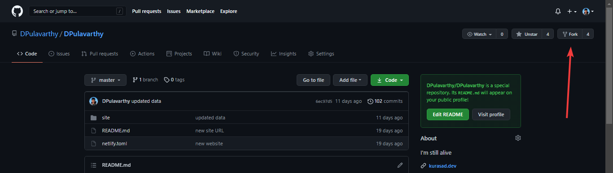

# Lesson 2 - Understanding what we are doing

## Table of contents
* ❯❯ Lesson 2
    * ❯❯ [Table of contents](#table-of-contents)
    * ❯❯ [Goals](#goals)
    * ❯❯ [⚠️ Notices (Please Read)](#%EF%B8%8F-notices)
    * ❯❯ [Section 1 - Introduction to HTML DIVs and JavaScript](#section-1)
        * ❯❯ [Breakdown](#breakdown)
        * ❯❯ [Void elements](#void-elements)
        * ❯❯ [HTML DIVs](#html-divs)
        * ❯❯ [IDs and Classes](#ids-and-classes)
        * ❯❯ [Combining everything in Section 1](#combining-everything-in-section-1)
    * ❯❯ [Section 2 - Make a HTML application with the use of JS styling and learning the abilites of CSS styling](#section-2)
        * ❯❯ [About](#about)
        * ❯❯ [JavaScript code snippets](#javascript-code-snippets)
        * ❯❯ [Styling the elements](#styling-the-elements)
        * ❯❯ [Styling with CSS](#styling-with-css)
        * ❯❯ [Styling with JavaScript](#styling-with-javascript)
    * ❯❯ [Section 3 - Make a HTML application with a JS integration](#section-3)
        * ❯❯ [HTML Tables & Grids](#html-tables--grids)
        * ❯❯ [JavaScript functions](#javascript-functions)
        * ❯❯ [API fetch](#api-fetch)
        * ❯❯ [HTML programming with JavaScript](#html-programming-with-javascript)
        * ❯❯ [Putting it all together](#putting-it-all-together)
    * ❯❯ [Guides](#guides)
        * ❯❯ [How to fork a repo](#how-to-fork-a-repo)
        * ❯❯ [How to clone a repo](#how-to-clone-a-repo)
        * ❯❯ [How to open a cloned folder in Visual Studio Code](#how-to-open-a-cloned-folder-in-visual-studio-code)
        * ❯❯ [How to install Visual Studio Code](#how-to-install-visual-studio-code)
        * ❯❯ [How to install GitHub Desktop](#how-to-install-github-desktop)
        * ❯❯ [How to install GIT](#how-to-install-git)


## Goals
#### ❯ [Introduction to HTML DIVs and JavaScript.](#section-1)
#### ❯ [Make a HTML application with the use of JS styling and learning the abilites of CSS styling.](#section-2)
#### ❯ [Make a HTML application with a JS integration.](#section-3)

## ⚠️ Notices
This lesson involves lots of basic HTML, CSS, and JS concepts. If any of this lesson feels difficult or incomprehendable, DM me on Discord ([Kurasad#2521](https://discord.com/users/476812566530883604)) and I will be happy to help.

## Section 1
### ❯❯ Introduction to HTML DIVs and JavaScript
<hr />

HyperText Markup Language (HTML) is a very basic structural layout of a webpage containing most of the data and unique identifiers. HTML data is categorized with the use of tags, an `<i>` tag will italicize the text inside and a `<div>` will act as a parent block to make sure everything inside stays together, generally. There are many tags that are used in HTML and each one serves a different purpose. Each tag has it's own styling and formatting (CSS). All descriptions of the layout of HTML code is relative since CSS can be used to modify and change the elements in any way possible. HTML & CSS do not have logical errors, there are syntax errors but everything written will exist on the page. 

### Breakdown
First, lets breakdown what a HTML page would generally look like.
```html
<html>

    <head> </head>

    <body> </body>

</html>
```

The `<html>` tag exists to define where the content of the page is. The `<head>` tag exists to hold all preloadable data, such as the CSS styles for the page or the `<meta>` tags. Meta tags define the webpage and are used in Google searches and on the page itself. Meta tags are used to hold the website's name, icon, description, and any other information about the webpage necessary for it to be identified on external services. The `<body>` tag is for holding the website content and the JavaScript imports/scripts, this is what the user will see when the visit the webpage. Almost all HTML tags need a closing tag, the `<body>` tag has `</body>` and so on, but some elements are not built to be closed. Such elements are called void elements and all the content necessary for these tags exist with one opening tag. The tags defined as void are the following: ``, `<hr />`, and `<br />`.

### Void elements
The `` tag is for importing external and local images to the webpage, the image tag has properties such as `src` and `alt` which define properties of the image and how the image can be interacted with. The image `src` property defines what image to show to represent the tag and is a required image property, ex: ``. The image `alt` property defines what the image should represent in the case that the `src` property has an invalid image URL, the `alt` property is a required image property, ex: ``. The image `title` properly exists to hold a string that the user can read when hovering over the image (tooltip), this is an optional image property but is useful for icons, ex: ``
The image tag also has the `id`, `class`, and `style` properties like all other tags. The other two tags (`<br />` and `<hr />`) are both used for formatting and only have `id`, `class`, and`style` properties. `<br />` is used as a newline element, in Javascript and other programming languages a newline break is defined by a `\n` but in HTML a `<br />` tag is used. The `<hr />` tag is used as a newline element with extra styling defaults, it also acts as a line break but adds a literal line at the break. All void elements are opened and closed within the same tag, the `/>` is a closing statement within the tag. This is optional to close the tag but will show up as an error.

### HTML DIVs
It is a good habit to group HTML elements with other elements that serve a similar purpose or function. Such as a navbar, all tab options are part of the nav bar, therefore they are "children" of the "parent" element navbar. This structure is how HTML works. A parent element contains children and the children can either have more children or contain data. Below is a structure that contains parents and children.
```html
<body>
    <a> Page under construction. </a>

    <div>
        <h1> Hello, World! </h1>
    </div>
    
    <div>
        <h3> I am a description. </h3>
        <div>
            
        </div>
    </div>

</body>
```

This snippet shows the structure of a HTML page content, The `<a>` tag is usually for text that is hyperlinked, the `<a>` tag is the only tag that can hyperlink text (without the use of JS). The first `<div>` tag contains a `<h1>` tag, this is a styling tag that is used for headings, the range is from `<h1>` to `<h6>`. The `<h1>` tag in this scenerio is a child to the parent element `<div>`. The second div contains two children, a `<h3>` tag and another `<div>`, the child `<div>` is also a parent since it contains an `` tag inside.
The image tag is a member of both div tags for that section. The DIVs help organize and format the page's content so that each section of data correlates to the data around it and interacts properly with each elements within the same scope and with elements not in the same scope.

### IDs and Classes
In the previous section a troublesome visualization would be understanding what each div represents and what content it holds. This is where the existance of IDs and Classes are useful. A HTML `id` is a property of an element and should exist for ONLY 1 element of the same scope, it is fine for having the same ID for a different element in a different scope but it might still cause issues for fetching the element in JavaScript. A HTML `class` is also a property of an element but can exist at any scope and can contain multiple values. For styling overlap between `id` and `class` the ID property would be superior unless the `class` style contains a `!important` parameter. Below is the same example from the section before but with proper identification.
```html
<body>
    <a id="notice"> Page under construction. </a>

    <div id="title">
        <h1 id="message" class="title"> Hello, World! </h1>
    </div>
    
    <div id="content" class="about images">
        <h3 id="description"> I am a description. </h3>
        <div id="logo">
            
        </div>
    </div>
</body>
```
One of the first things you may notice is that there is a parent DIV with an id value of `title` and a child element with a class value of `title`, in styling these elements the CSS will be able to identify the ID and class difference to not have overlapping or incorrect styles. The div will only have styles regarding a `#image { ... }` CSS block, and the `<h1>` element will only have styles regarding a `#message { ... }` and `.title { ... }` CSS blocks. You might be wondering what the `#` and `.` definers are before the tag definer. These are the parameters that CSS uses in order to define styles between a ID(`#`) and class(`.`). Styling by a element type just involves using the element name, ex: style body by using `body { ... }`. CSS can also style specific child/parent elements so that not every style has to be declared globally. Below is an example:
```css
/* Case 1 */
.title { ... }

/* Case 2 */
#title #message { ... }

/* Case 3 */
body #title .title { ... }
```
Case 1 states that any element with a class `title` should use its styles. Case 2 states that any element with the ID `message` located inside an element with an ID `title` should use its styles. Case 3 states that any element with the class `title` inside an element with and ID `title` inside a tag `body` should use its styles. In most scenerios Case 2 will be most helpful, Case 1 is mainly for when you want to make all specific elements on a page share styles. Case 3 is more descriptive of the path to the required element but Case 2 is sufficent in providing the required path. Note that every element does not require an ID to function, only ones you wish to uniquely identify in order to modify.

### Combining everything in Section 1
Lets make an example combining everything we have covered so far. If you have not done this already, [fork this repo](#how-to-fork-a-repo) and [clone it to your local](#how-to-clone-a-repo), then open [open the repo in Visual Studio Code](#how-to-open-a-cloned-folder-in-visual-studio-code). Let's first copy over the code from the following codeblock into the body tag of the `index.html` located in [`./source/section-1/index.html`](source/section-1/index.html). 
```html
<a id="notice"> Page under construction. </a>

<div id="title">
    <h1 id="message" class="title"> Hello, World! </h1>
</div>

<div id="content" class="about images">
    <h3 id="description"> I am a description. </h3>
    <div id="logo">
        
        
    </div>
</div>
```
If you have done everything properly the end result should look like this:


Now try to make the webpage look like this:
Note: No CSS has to be modified for these changes


If you were able to do it your code should look like the following:
```html
<a id="notice"> Welcome </a>

<div id="title">
    <h1 id="message" class="title"> Hello, World! </h1>
</div>

<div id="content" class="about images">
    <div id="logo">
        
        
    </div>
    <h3> I am a description. </h3>
</div>
```

## Section 2
### ❯❯ Make a HTML application with the use of JS styling and learning the abilites of CSS styling
<hr />

#### About
Now that you have learned the basics of HTML and the way CSS styles specific elements we can move on and introduce some basic JS. JavaScript is a powerful library that allows you to build integrations, applications, and many more things. Today we will go into one of the basic uses for JavaScript in HTML, making dynamic content. Many websites can have data that has to be updated constantly or modified when a user takes an action. Since HTML and CSS runs on load and does not run on events the only modification is possible through the use of JavaScript.

#### JavaScript code snippets
Here are some code snippets that have the basic syntax for simple javascript functions.

##### Loops
```js
// For loop.
for (let i = 0; i < 10; i++) { ... }

// ForEach loop.
for (let item of array ) { ... }

// While loop.
while (elem === true) { ... } 
```

##### If-statements
```js
let x = 5

// This is a full if-statement.
if (x === 2) {
    // Do this.
} else if (x === 4) {
    // Do this.
} else {
    // Do this.
}

// Inline if-statement.
let y = x === 5 ? true : false

// The inline statement converts the follwing:
let y
if (x === 5) {
    y = true
} else {
    y = false
}

```

##### Variables
```js
// ';' optional in most cases.
var x = 55; // Variable declared as 'var' and its value is a integer (55).
let y = "e"; // Variable declared as 'let' and its value is a string (e).
const z = x + y; // Variable declared as 'const' and its value is a string (55e).
// A variable declared as 'const' cannot be redifined.

x = z; // Works
z = y; // Fails
```

##### Objects
```js
// Most APIs and data is represented by objects, this type of data works in a similar way to HTML in that it has parent and childen.
// But the main element is usually declared to a variable and the elements inside are properties of the variable.
let obj = {
    x: 1,
    y: {
        z: 2
    }
}

console.log(obj) // { x: 1, y: { z: 2 } }
console.log(obj.x) // 1
console.log(obj.y) // { z: 2 }
console.log(obj.y.z) // 2
```

##### WebJS element grabber
```html
<body>
    <a id="msg">Hello</a>

    <div id="list">
        <p id="item1" class="item">1</p>
        <p id="item2" class="item">2</p>
        <p id="item3" class="item">3</p>
    </div>

    <script>
        // All elements are a property of the 'document'.
        // To get an element by it's ID use the getElementById() function.
        document.getElementById(`msg`)

        // To access the text inisde the element, use the 'innerHTML' property on the function.
        console.log(document.getElementById(`msg`).innerHTML) // Hello

        // To get an element by it's class use the getElementsByClassName() function.
        let arr = document.getElementsByClassName(`item`) // Returns an array.
        // Simplified representation below.
        /* 
        arr => [
            {
                id: `item1`,
                innerHTML: 1
            },
            {
                id: `item2`,
                innerHTML: 2
            },
            {
                id: `item3`,
                innerHTML: 3
            }
        ]
        */

        // So to access the first element's info we can get the first index of the array.
        let elem = arr[0]

        // Now we can get the value of the element's information.
        console.log(elem.innerHTML) // 1
    </script>
</body>
```

#### Styling the elements

As seen in the [WebJS element grabber code snippet](#webjs-element-grabber) all elements can be accessed from the global `document` variable, including the content of the element, styles, and its children if they exist. In this case `element` represents the fetched element. To access the element's inner data you can use `element.innerHTML` and this will return a string of the data inside the tag. TO access the element's styles you can use `element.style` and any sub-property is a style of the element. To fetch an element inside a specific parent we can use the following code:
```js
let parent = document.getElementById(`ELEMENT_ID`)
let child = parent.getElementById(`ELEMENT_ID`)
// child is now an element that is searched in the scope of parent.

// Inline:
let element = document.getElementById(`ELEMENT_ID`).getElementById(`ELEMENT_ID`)
```

#### Styling with CSS

CSS has many styles you can use on an element, styles defined at a closer scope override elements in a bigger scope. And elements styles using an ID override a styles using classes. Using a `!important` parameter for element styles override all other styles disregarding the scope. Below are some common CSS styles and what they do. Use the following HTML as reference.
```html
<div id="element" class="parent">
    <p id="text" class="child"> Hi </p>
</div>
```
```css
/* All styles inside this type of CSS style block will be modifing all elements, disregarding they require/use the property. */
* {
    color: #00FF00;
}

#element {
    /* Padding for the whole element. */
    padding: 10px;

    /* Padding with speicfied fields. 10px for top/bottom, 5px for left/right */
    padding: 10px 5px;

    /* Padding with specified sides. 10px for top, 5px for right, 20px for bottom, 7px for left. */
    padding: 10px 5px 20px 7px;

    /* In the cases above the last style will override the first two, not because it is the most detailed, but because it appears last. */
}

.child {
    /* White text color. */
    color: #000000; 
}

/* Any style found here will override any styles in 'child' class styles. */
#text {
    /* Red text color. */
    color: #FF0000;
}
```
#### `padding`: Padding around an element's content, moves the edge of the div/area farther from the content. (Content based)
#### `margin`: Margin of the content from the border of the div/area. (div/area based)
#### `color`: The text color of the element's content.
#### `background`: The background style. (Image, Color)
#### `text-shadow`: The shadow distance and color for text.
#### `font-weight`: The weight of the font, increases in increments of 100, above 800 is bold.

### Styling with JavaScript

If you open the `style.css` located in the path [`./source/section-2/style.css`](source/section-2/style.css) has all the styles for the site. Now we will remake each code style using JavaScript.

First let's start of with the first style block:
```css
* {
    color: #C0C0C0;
}
```
This states that all elements should have a default text color of `#C0C0C0`. When translated to JavaScript we can just edit the style of the `<html>` tag, hence doing the same action as the CSS block. When translating from CSS to JS for styles we can see that some CSS styles contain a `-` character. This is not vaild in JavaScript since `style.font-weight` would cause an error, we would have to translate it to look like `style.fontWeight`.
```js
document.getElementsByTagName(`html`)[0].style.color = `#C0C0C0`;
```
When you open the file you will see that there is no element styling, this is something you will do with the JavaScript as the CSS has been nullified. Below is what you should see on the default file:


After getting a touch on this concept practice by converting all other element styles from CSS to JavaScript. Add all your JavaScript code to the [`./source/section-2/script.js`](source/section-2/script.js) file. If you are editing multiple styles for a single element declare the element fetch to a variable and edit the styles for the element through the variable. Notice that you will mostly be using up to three fetch types.
```js
document.getElementById(`ID`) // Type: Object.
document.getElementsByTagName(`TAG`) // Type: Array of Objects.
document.getElementsByClassName(`CLASS`) // Type: Array of Objects.
```

If you properly get all elements re-styled in JavaScript your page should look like this:


## Section 3
### ❯❯ Make a HTML application with a JS integration
<hr />

JavaScript can also be used to integrate external services. If you wanted to add weather to your website, a google maps location picker, or any other feature, you would likely need JS. Once you learn JavaScript and how it functions it gets pretty simple to make programs with it. A simple program that show's the ability would be an API request. So lets make a program with an API request. But before we do so need to cover some more topics.

#### HTML Tables & Grids
Tables and grids are a part of HTML that is used to organize data. Tables exist within an DIV and organize text and images. Grids are made with DIVs and CSS, the DIVs will be organized automatically according to what the CSS states. Grids can organize sections of data, combine data, and reorder elements on the page with ease.

Below is the code example of a table:
```html
<table>
    <tr>
        <th> Heading </th>
    </tr>
    <tr>
        <td> Data </td>
    </tr>
<table>
<!-- Styles not provided. -->
```
The output would be 2 cells that look like the following:
| Heading |
| ------- |
| Data    |

The table is defined with the `<table>` tag, the `<tr>` tag defines a new row on the table. The more elements that exist within a row create a column. EX: 
```html
<table>
    <tr>
        <th> Heading </th>
        <th> Body </th>
        <th> About </th>
    </tr>
    <tr>
        <td> Data </td>
        <td> Item2 </td>
        <td> None </td>
    </tr>
<table>
<!-- Styles not provided. -->
```
The three `<th>` tag represent three columns on the table. The `<th>` tag represents a header tag, this is a cell on a table that is bolded since it labels the data that the table contains and does not contain the table data. The `<td>` tag represents data in a cell, usually text or images, this tag is where the table's data is found. The `<th>` is optional when making a table.

The grid styles will be covered in the next lesson.

#### JavaScript functions

JavaScript has functions for repretitive or complex tasks. A function is a block of code that runs when called or when its test case is true, otherwise it does not run. Functions exist to make repetitive tasks easier or to break down large actions into smaller pieces. The syntax for a JavaScript function is the following:
```js
function name(params) {
    // Code here.
}

let name = (params) => {
    // Code here.
}
```
The function is defined by the word `function`, the `name` of the function is what you will use to call the function. The `params` are data that is passed into the function so it can use them to complete its task. The second statement is a function declared to a variable, the format is similar and functions the same, but in this case the variable has to be declared before it is used. Also, Parameteres are optional when declaring a function but are useful for when the function cannot access the data. Functions can reuturn data back to the calling statement. EX:
```js
let x = add(4, 5) // Function called here, returned: 9.

function add(x, y) {
    let z = x + y // Function logic here.
    return z // Return final data.
}
```

Functions can be accessed by code in the same or smaller scope but cannot be accessed by a higher scope.
```js
run() // TypeError: run is not a function

{ // These brackets define a new scope.
  function run() { // Function is defined here.
    console.log(`HI`) // Function's task.
  }

  run() // Successful run.
}
```
The `run` function call that is out of scope of the function returns an error. 

#### API fetch

An API is a external service that is hosted by the service provider, the end user can access the API to get raw data. Data is usually formatted so that the end user will have a nice frontend view of their data. But since we do not need a frontend we just request the data. Doing so makes APIs fast and reliable. There are a few ways to fetch API information with JavaScript but in this case we will use the built-in WebJS `fetch` module. This module works in the following way:
```js
fetch("URL") // First we fetch the desired URL.

    .then(result => result.json()) // Then we pull the JSON format (Object) data.

    .then(data => { ... }) // Now we can modify the data however we desire.
```
The purpose for the `fetch().then().then()` format is because APIs are fast but not fast enough. APIs take a few MS to return data and the program has already moved on by then. There are two ways to solve this. One, use a `async`/`await` system where you wait for the data and then modify it. The problem with this way is that the entire JavaScript file would need to be made async, EX:
```js
(async () => {
    let request = await fetch("URL")
    let result = await request.json()
    // Code logic here.
})()
```
Another way to do it is by using a `.then()` statement, all the code inside the then statement will wait for the first process to finish before running. In this case the first then statement waits for the API data to be fetched, then it pulls the JSON data from the request. The second statement waits for the JSON data to be extracted from the request, it will then run whatever code exists within the block.

#### HTML programming with JavaScript

Just as it's possible to change element styles with JavaScript you can also change the data that an element holds
```html
<body>
    <a id="item"> Hi </a>

    <script>
        let element = document.getElementById(`item`) // Fetch element.
        element.innerHTML = `Bye` // Redefine element.
    </script>
</body>
```
When this code is run the end user will see the text `Bye` in the place of `Hi`. But it doesn't just stop at text, you can also edit the `innerHTML` field to add more HTML code inside an element. EX:
```html
<body>
    <div id="image"></a>

    <script>
        let element = document.getElementById(`image`) // Fetch element.
        element.innerHTML = `<a> Image Description </a>` // Redefine element.
    </script>
</body>
```
This would now show the image as well as some text after inside the DIV. This is useful for dynamic data or data that needs to be updated every time a specific event happens.

#### Putting it all together

Now lets make an HTML application that integrates everything so far. Now we head to the section-3 folder of the source code. Open the `index.html` located at [`./source/section-3/index.html`](source/section-3/index.html) and insert the following code into the body.
```html
<table id="data"></table>
<script src="script.js"></script>
```
This defines a new table that has an ID `data`. We will use this table to show the data. The script tag imports the JavaScript since it is located in its own file. Now we need to fetch the data to put it in the table. The data we need to use is found at [hacking-with-ht.ml/homebase/apps.json](http://hacking-with-ht.ml/homebase/apps.json), so lets fetch the data located on this page. Start by opening the `script.js` file in [`./source/section-3/script.js`](source/section-3/script.js), the file should be empty so lets add the following code to fetch
```js
fetch("URL").then(res => res.json()).then(data => { })
```
This is the fetch block that was defined before, replace `URL` with the JSON applist URL. Now we get the data but we need to format it. How about making it a function so we don't need to put all the logic in the same place
```js
function autoFormat(data) {
    let array = [`<tr><th>App Name</th><th>App Link</th></tr>`]
}
```
Now we have an function with an array that can store the HTML data we need. Next we need code that will loop though the data and add it to the array in the proper format. Well to add to an array we can use `<Array>.push()`, and we can use one of the for loops to iterate through the `data` list and add to the `array`. In this case the for-each loop would be the fastest. Declare the loop with the following:
```js
// Insert inside the function.
for (let site of data) {
    
}
```
This will iterate though the entire data array and use site as the variable. Now we an append to the array with the HTML code:
```js
// Insert inside the for loop.
let htmlString = `<tr><td>${site.title}</td><td><a href="https://${site.link}" target="_blank"> Click here </a></td></tr>`
array.push(htmlString)
```
Using a `${}` inside a string is only possible when using the \` quote. This set of characters acts as an escape section, anything inside the brackets will be referenced from variables and will execute code. Since site is an object with 2 properties title and link, we can access them and put them into the HTML string. Now that the array is complete and contains all the formatted data, we need to return the data back to the caller. Do this with the return statement.
```js
// Insert AFTER the for loop.
return array.join(`\n`)
```
The join statement combines all items in an array and breaks them using the character that you pass, in this case we passed `\n` so the returned statement would be the HTML string, and the `\n` which is the newline character, and then the second string and so on. With the data returned to the caller the function's returned data needs to be put in the table. So first fetch the HTML table with it's ID and set the `innerHTML` to the returned data.
```js
let formattedData = autoFormat(data)
document.getElementById(`data`).innerHTML = formattedData
```

And that's it, check if the table loads by opening/refreshing the index.html in the browser. If everything was done correct this should be the result:


Clicking on the `Click here` should open the app in a new tab. The table should only have 2 columns and the list should contain a list of websites that were in the `apps.json` list.

## Guides
These guides exist to help understand how some functions of this project work. All guides are optimized for Windows systems.
<hr />

### How to fork a repo
#### Updated: 06/11/2021
#### Pre-req: [GitHub Account](https://github.com/login)
#### About: This guide will explain how to fork a repo on GitHub.
<hr />

#### Step 1: Go to the repo
A simple step, but you have to make sure you are forking the correct repo.

#### Step 2: Fork
Click the fork button found in the top right of the page to fork the repo.


<hr />

### How to clone a repo
#### Updated: 06/11/2021
#### Pre-req: [GitHub Account](https://github.com/login), [GitHub Desktop](#how-to-install-github-desktop), [Visual Studio Code](#how-to-install-visual-studio-code) (Optional), [GIT](#how-to-install-git)
#### About: This guide will explain how to clone a repo from GitHub to your local system.
<hr />

#### Step 1: Go to the repo
A simple step, but you have to make sure you are cloning the correct repo.

#### Step 2: Clone Button
Click the clone button to open GitHub Desktop and clone it to your local system.


#### Fallback: In the case that you do not want to use GitHub Desktop but the CLI version (GIT), do the following:
Open a new terminal window, then go to the documents folder by using the following command:
```bash
cd Documents
```

Inside documents if you do not have a GitHub folder make one by using the following command:
```bash
mkdir GitHub
```
else just open the folder with the command
```bash
cd GitHub
```

Once you have entered the folder you can clone the GitHub repo with the following command:
```bash
git clone https://github.com/<USER_OR_ORG>/<REPO_NAME>
```
<hr />

### How to open a cloned folder in Visual Studio Code
#### Updated: 06/11/2021
#### Pre-req: [Visual Studio Code](#how-to-install-visual-studio-code)
#### About: This guide will explain how to clone a repo from GitHub to your local system.
<hr />

#### Step 1: Open Visual Studio Code
Open Visual Studio Code in order to open the cloned repo.

#### Step 2: Open the file explorer though VSC
Open the file explorer in VSC by doing the following:


#### Step 3: Find and select the desired folder
In the file explorer locate and select the desired folder to open in VSC.


<hr />

### How to install Visual Studio Code
#### Updated: 06/11/2021
#### Pre-req: None
#### About: This guide will explain how to install the Visual Studio Code (VSC) application.
<hr />

#### Step 1: Download
Download at the [Visual Studio Code download page](https://code.visualstudio.com/download) *(Link last updated: 06/11/2021)*


#### Step 2: Install
Follow the instruction guide *(Last updated: 06/11/2021)*.

Agree to the terms and click next.


Keep the default location and click next.


Keep the default value and click next.


Select all options under "other" and click next.


Make sure all the information so far is correct and click next.


Wait for the application to install and click next.


Click finish to open Visual Studio Code.


<hr />

### How to install GitHub Desktop
#### Updated: 06/11/2021
#### Pre-req: [GitHub Account](https://github.com/login)
#### About: This guide will explain how to install the GitHub Desktop application.
<hr />

#### Step 1: Download
Download at the [GitHub Desktop download page](https://desktop.github.com/) *(Link last updated: 06/11/2021)*

#### Step 2: Install
Follow the setup wizard to install, logic, and clone desired repos.
<hr />

### How to install GIT
#### Updated: 06/11/2021
#### Pre-req: None
#### About: This guide will explain how to install the GIT service to your system.
<hr />

#### Step 1: Download
Download at the [GIT download page](https://git-scm.com/downloads) *(Link last updated: 06/11/2021)*

#### Step 2: Install
Follow the setup wizard to install, the only change necessary is to change the default GIT editor to VSC:


<hr />

### [Back to top ⬆️](#lesson-2---understanding-what-we-are-doing)
